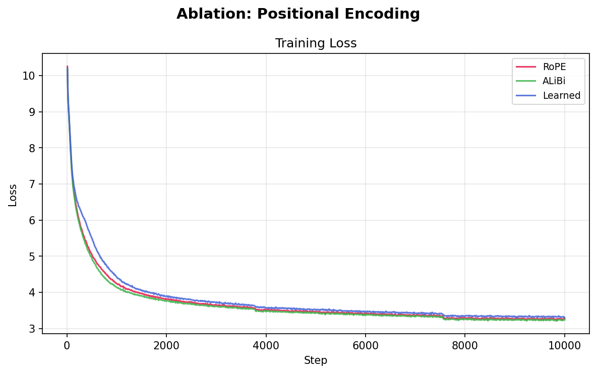
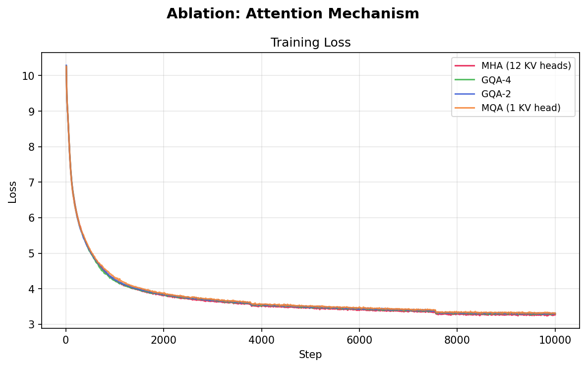
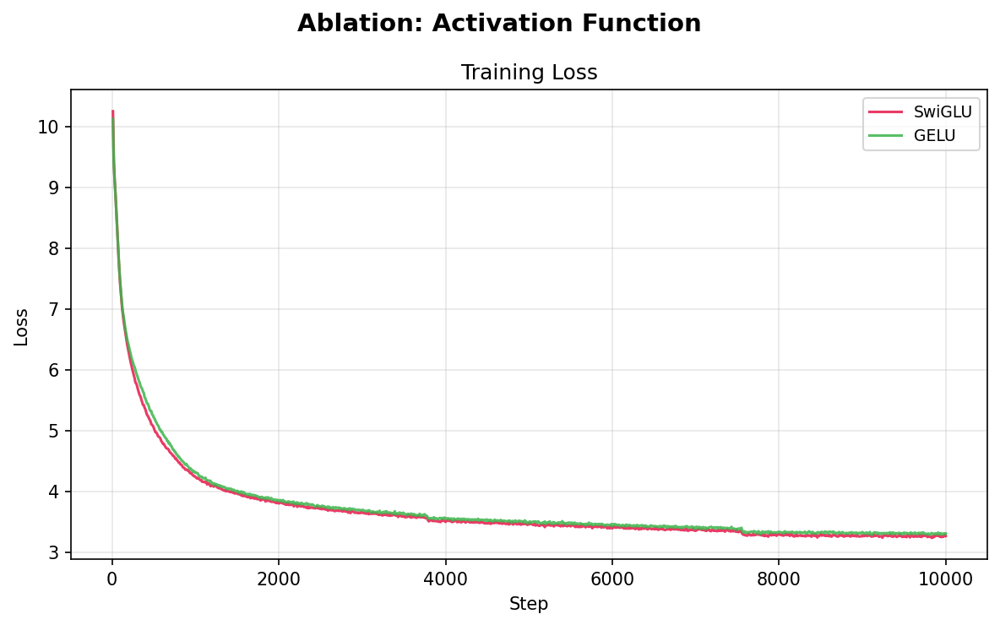
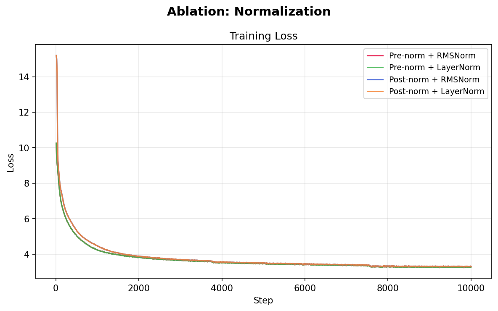
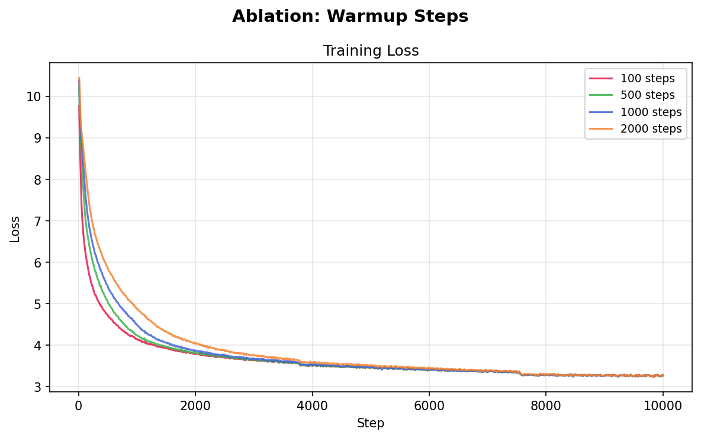
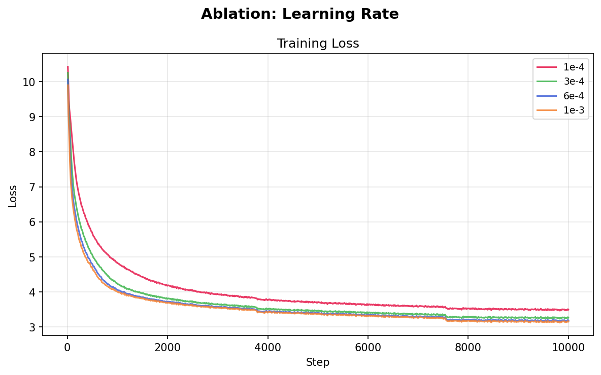

# SmallScale: Systematic Ablation Study of Transformer Architecture Choices at 110M Scale

A from-scratch implementation of transformer language model training with systematic ablation studies across 6 architectural dimensions and 21 controlled experiments. Every component — model, BPE tokenizer, data pipeline, training loop, evaluation — is written from scratch in PyTorch.

## Key Findings

Each ablation isolates exactly one variable from the base config. Ranked by final training loss at 10K steps on 500M tokens of FineWeb-Edu:

| Ablation | Winner | Runner-up | Gap |
|----------|--------|-----------|-----|
| Positional Encoding | ALiBi (3.238) | RoPE (3.266) | 0.028 |
| Attention Mechanism | MHA (3.267) | GQA-4 (3.299) | 0.032 |
| Activation Function | SwiGLU (3.267) | GELU (3.307) | 0.040 |
| Normalization | Pre-norm + LayerNorm (3.266) | Post-norm + RMSNorm (3.305) | 0.039 |
| Warmup Steps | 1000 steps (3.265) | 100 steps (3.273) | 0.008 |
| Learning Rate | 1e-3 (3.157) | 3e-4 (3.267) | 0.110 |

### Recommended Best Stack

Combining the winner from each independent ablation:

```
Positional Encoding:  ALiBi
Attention:            MHA (12 KV heads)
Activation:           SwiGLU
Normalization:        Pre-norm + LayerNorm
Warmup:               1000 steps
Learning Rate:        1e-3
```

## Training Loss Curves

### Positional Encoding


### Attention Mechanism


### Activation Function


### Normalization


### Warmup Steps


### Learning Rate


## Architecture

110M parameter causal transformer with configurable components:

| Component | Options | Default |
|-----------|---------|---------|
| Positional encoding | RoPE, ALiBi, Learned | RoPE |
| Attention | MHA, GQA-4, GQA-2, MQA | MHA (12 KV heads) |
| Activation | SwiGLU, GELU | SwiGLU |
| Normalization | RMSNorm, LayerNorm | RMSNorm |
| Norm placement | Pre-norm, Post-norm | Pre-norm |

### Base Model Specs

```
Parameters:    109.5M total (85.0M non-embedding)
Layers:        12
Hidden dim:    768
Attention:     12 heads, 64 head dim
Context:       1024 tokens
Vocab:         32,000 (BPE, trained from scratch)
Embeddings:    Tied (input + LM head share weights)
```

## Project Structure

```
SmallScale/
├── configs/
│   ├── base.yaml           # Base 110M config (control experiment)
│   └── ablation.yaml       # Fast ablation config (10K steps)
├── model/
│   ├── transformer.py      # Full model: embeddings, blocks, LM head
│   ├── attention.py        # MHA/GQA/MQA with Flash Attention (SDPA)
│   ├── positional.py       # RoPE, ALiBi, Learned positional encodings
│   ├── feedforward.py      # SwiGLU and GELU FFN variants
│   └── norms.py            # RMSNorm, LayerNorm
├── data/
│   ├── tokenizer.py        # BPE tokenizer from scratch
│   ├── dataset.py          # Memory-mapped token streaming
│   └── prepare.py          # FineWeb-Edu download and preprocessing
├── training/
│   ├── trainer.py          # Training loop with grad accum + AMP
│   ├── optimizer.py        # AdamW with decoupled weight decay
│   └── scheduler.py        # Cosine, linear, constant LR schedules
├── evaluation/
│   ├── analysis.py         # Per-suite plots, ranked tables, best stack
│   └── benchmarks.py       # Perplexity, HellaSwag, text generation
├── utils/
│   ├── config.py           # Dataclass configs with YAML loading
│   └── logging.py          # CSV + optional W&B experiment tracking
├── train.py                # Main training entry point
└── run_ablations.py        # Ablation suite orchestrator
```

## Quick Start

```bash
# Install dependencies
uv sync

# 1. Prepare data (downloads FineWeb-Edu, trains BPE tokenizer, tokenizes to binary)
python -m data.prepare --output_dir ./data/processed --num_tokens 500000000

# 2. Train base model (25K steps, ~15 hrs on A40)
python train.py --config configs/base.yaml

# 3. Run all 21 ablation experiments (10K steps each)
python run_ablations.py --suite all --base_config configs/ablation.yaml

# 4. Resume ablations (skips already-completed experiments)
python run_ablations.py --suite all --base_config configs/ablation.yaml --resume

# 5. Generate analysis: ranked tables, per-suite plots, best stack recommendation
python -m evaluation.analysis --exp_dir ./experiments/
```

### Running Individual Ablation Suites

```bash
python run_ablations.py --suite positional_encoding --base_config configs/ablation.yaml
python run_ablations.py --suite attention --base_config configs/ablation.yaml
python run_ablations.py --suite activation --base_config configs/ablation.yaml
python run_ablations.py --suite normalization --base_config configs/ablation.yaml
python run_ablations.py --suite warmup --base_config configs/ablation.yaml
python run_ablations.py --suite lr --base_config configs/ablation.yaml
```

### Custom Experiments

```bash
# Override any config value with dotted notation
python train.py --config configs/base.yaml \
  --override model.pos_encoding=alibi \
  --override model.activation=gelu \
  --override training.lr=6e-4 \
  --override name=custom_experiment
```

## Training Details

| Setting | Base Model | Ablation Runs |
|---------|-----------|---------------|
| Steps | 50,000 | 10,000 |
| Effective batch | 128 (32 x 4 accum) | 128 (64 x 2 accum) |
| Tokens/step | 131,072 | 131,072 |
| LR schedule | Cosine decay | Cosine decay |
| Warmup | 500 steps | 500 steps |
| Precision | bfloat16 | bfloat16 |
| torch.compile | Yes | Yes |
| Data | 500M tokens FineWeb-Edu | Same |

### Hardware Used

- Base model: NVIDIA A40 (48GB)
- Ablation runs: NVIDIA H100 (80GB)

## Full Ranking (all 21 experiments)

| Rank | Experiment | Final Train Loss | Train PPL | Throughput (tok/s) |
|------|-----------|-----------------|-----------|-------------------|
| 1 | lr_1e3 | 3.1565 | 23.49 | 430,307 |
| 2 | lr_6e4 | 3.1879 | 24.24 | 425,904 |
| 3 | pos_alibi | 3.2380 | 25.48 | 306,989 |
| 4 | warmup_1000 | 3.2645 | 26.17 | 430,293 |
| 5 | norm_pre_layernorm | 3.2659 | 26.20 | 423,116 |
| 6 | pos_rope | 3.2660 | 26.21 | 428,814 |
| 7 | norm_pre_rmsnorm | 3.2668 | 26.23 | 428,509 |
| 8 | attn_mha | 3.2670 | 26.23 | 431,290 |
| 9 | lr_3e4 | 3.2670 | 26.23 | 430,106 |
| 10 | act_swiglu | 3.2671 | 26.24 | 429,781 |
| 11 | warmup_2000 | 3.2681 | 26.26 | 431,477 |
| 12 | warmup_500 | 3.2682 | 26.26 | 430,864 |
| 13 | warmup_100 | 3.2725 | 26.38 | 430,505 |
| 14 | attn_gqa4 | 3.2985 | 27.07 | 439,999 |
| 15 | pos_learned | 3.3001 | 27.12 | 457,796 |
| 16 | norm_post_layernorm | 3.3043 | 27.23 | 422,560 |
| 17 | norm_post_rmsnorm | 3.3045 | 27.23 | 423,272 |
| 18 | act_gelu | 3.3068 | 27.30 | 476,751 |
| 19 | attn_gqa2 | 3.3109 | 27.41 | 447,290 |
| 20 | attn_mqa | 3.3113 | 27.42 | 441,266 |
| 21 | lr_1e4 | 3.4964 | 33.00 | 429,854 |

## Data Pipeline

1. **Source**: FineWeb-Edu (curated educational web text from HuggingFace)
2. **Tokenizer**: BPE trained from scratch on 10K documents, 32K vocab
3. **Format**: Memory-mapped binary (uint16) for zero-copy data loading
4. **Split**: 99% train (495M tokens) / 1% validation (5M tokens)

## Ablation Methodology

Each ablation changes exactly one variable from the base config, enabling clean causal attribution. The base config serves as the control:

```yaml
Base: RoPE + MHA + SwiGLU + Pre-norm RMSNorm + warmup=500 + lr=3e-4
```

Screening runs use 10K steps (enough to observe relative ranking between configs). The `run_ablations.py` orchestrator manages all 21 experiments with `--resume` support for fault tolerance.
